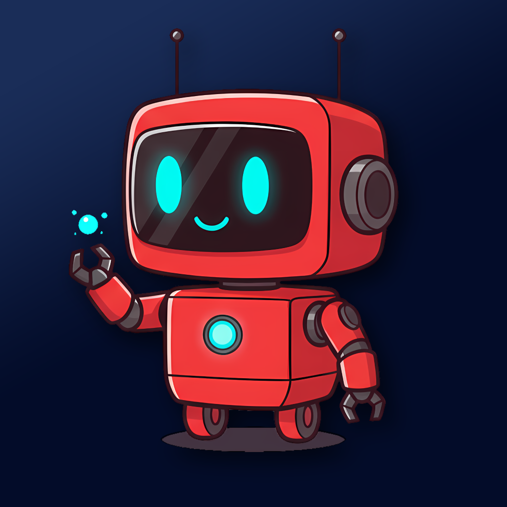
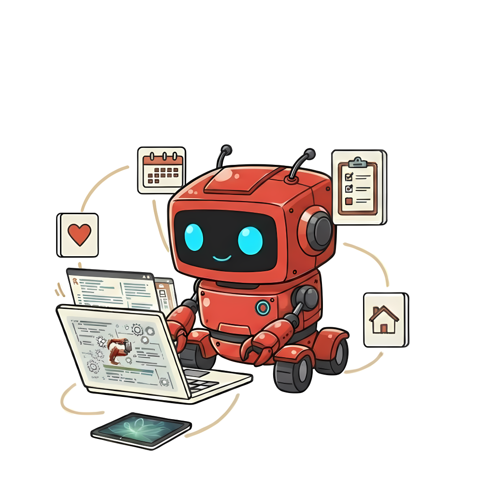

# Pinch Community Repository

<p align="center">
  
</p>

Welcome to the **Pinch Community Repository**! This is the central hub for users to share and discover custom **Services** and **Skills** for the Pinch app.

## 📂 Repository Structure

### Services


- **`services/`**: Contains user-submitted Service definitions.
    - Each service resides in its own folder: `services/{author}-{serviceId}/service.json`.

### Skills


- **`skills/`**: Contains user-submitted Skill definitions.
    - Each skill resides in its own folder: `skills/{author}-{skillId}/skill.json`.
- **`manifest.json`**: An auto-generated index of all available services and skills. **Do not edit this file manually.**

## 🚀 How to Contribute

We welcome contributions! You can add new services or skills by submitting a Pull Request.

### Adding a New Service

1.  **Fork** this repository.
2.  Create a new folder in `services/` named `{your-github-username}-{service-id}`.
    - Example: `services/octocat-hacker-news/`
3.  Add a `service.json` file inside that folder.
    - See [Service Schema](#service-schema) below.
4.  Submit a Pull Request.

### Adding a New Skill

1.  **Fork** this repository.
2.  Create a new folder in `skills/` named `{your-github-username}-{skill-id}`.
    - Example: `skills/octocat-morning-briefing/`
3.  Add a `skill.json` file inside that folder.
    - See [Skill Schema](#skill-schema) below.
4.  Submit a Pull Request.

## 📜 JSON Schemas

### Service Schema (`service.json`)

```json
{
  "author": "github_username",
  "version": "1.0.0",
  "tags": ["news", "tech", "api"],
  "definition": {
    "id": "unique-service-id",
    "name": "Service Name",
    "description": "Description of the service.",
    "apiUrl": "https://api.example.com/v1/endpoint",
    "method": "GET",
    "headers": {
      "Content-Type": "application/json"
    },
    "toolDefinition": "{\"name\": \"toolName\", ...}",
    "responseKeys": ["key1", "key2"],
    "apiKeyUrl": null,
    "isEnabled": true
  }
}
```

### Skill Schema (`skill.json`)

```json
{
  "author": "github_username",
  "version": "1.0.0",
  "description": "Description of what this skill does.",
  "tags": ["tag1", "tag2"],
  "definition": {
    "id": "unique-skill-id",
    "name": "Skill Name",
    "icon": "star.fill",
    "colorHex": "FF9500",
    "prompt": "The prompt text...",
    "requiredServices": ["service-id-1", "service-id-2"],
    "isEnabled": true,
    "isBuiltIn": false
  }
}
```
